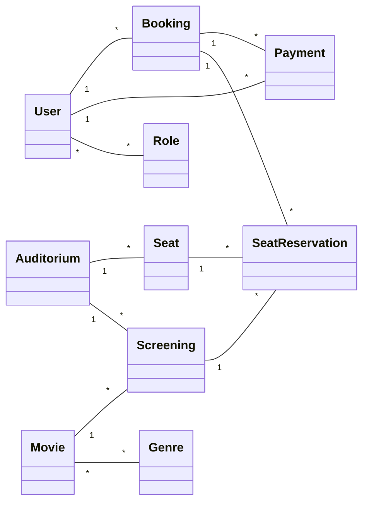

# Handlingsoversigt og systemdesign for Biografplatform

Denne handlingsoversigt beskriver et forslag til domænemodel, arkitektur og use cases for en biografplatform bygget med C# .NET Core, Angular og et ORM-lag (Entity Framework Core). Dokumentet fungerer som pejlemærke for udviklings- og testarbejdet.

## Overordnet mål og aktører
- **Aktører:** Gæst/Bruger, Registreret kunde, Administrator, Kassemedarbejder, Betalingsudbyder (ekstern).
- **Mål:** Muliggøre billetkøb, sædevalg, betaling, profilhåndtering og administration af film, visninger og sale.
- **Kvalitetskrav:** Sikker login, audit-logging, lagdelt arkitektur (Controller → Service/BLL → Repository → DbContext), integrationstest af endpoints og enhedstest pr. handling.

## Domænemodel (6-14 klasser)
Foreslåede entiteter med nøglefelter og relationer. M-M repræsenteres mellem **User** og **Role** samt **Movie** og **Genre**.

- **User**: Id, Email, PasswordHash, Salt, FullName, LoyaltyPoints, CreatedAt. Relationer: M-M Roles; 1-* Bookings; 1-* Payments.
- **Role**: Id, Name, Description. Relationer: M-M Users.
- **Movie**: Id, Title, Description, DurationMinutes, AgeRating, PosterUrl. Relationer: 1-* Screenings; M-M Genres.
- **Genre**: Id, Name. Relationer: M-M Movies.
- **Auditorium**: Id, Name, SeatRows, SeatColumns. Relationer: 1-* Screenings; 1-* Seats.
- **Seat**: Id, AuditoriumId, Row, Number, SeatType (enum). Relationer: *-1 Auditorium; 1-* SeatReservations.
- **Screening**: Id, MovieId, AuditoriumId, StartTime, BasePrice. Relationer: 1-* SeatReservations; *-1 Movie; *-1 Auditorium.
- **SeatReservation**: Id, ScreeningId, SeatId, BookingId, Price, Status (Reserved/Paid/Refunded). Relationer: *-1 Screening; *-1 Seat; *-1 Booking.
- **Booking**: Id, UserId, CreatedAt, Status (Pending/Paid/Cancelled), TotalAmount. Relationer: 1-* Payments; 1-* SeatReservations; *-1 User.
- **Payment**: Id, BookingId, Provider, ProviderReference, Amount, Currency, Status, PaidAt. Relationer: *-1 Booking; *-1 User (audit).

### Klassediagram (mermaid)

## Lagdelt arkitektur
- **API-lag (Controllers):** REST-endpoints, autorisation, request-validering, modelbinding.
- **Service/BLL:** Forretningsregler (prisberegning med rabat, flere sæder per booking, statusovergange, loyalitetsoptjening).
- **Repository/DAL:** Interfaces som `IBookingRepository`, `IScreeningRepository`, `IUserRepository`, implementeret med EF Core (`BiografDbContext`).
- **Cross-cutting:** Logging (Serilog), exception-handling middleware, JWT-baseret authentication, FluentValidation til DTO-validering.

### Interface-eksempler
- `IBookingService`: `Task<BookingDto> CreateAsync(CreateBookingDto dto)`, `Task<BookingDto> PayAsync(Guid bookingId, PaymentRequest request)`, `Task CancelAsync(Guid bookingId)`.
- `ISeatReservationService`: `Task<IEnumerable<SeatReservationDto>> ReserveAsync(Guid screeningId, IEnumerable<SeatSelectionDto> seats)`.
- `IUserService`: `Task<TokenResponse> LoginAsync(LoginRequest request)`, `Task<UserDto> RegisterAsync(RegisterUserDto dto)`, `Task AssignRoleAsync(Guid userId, string role)`.

## Use cases (eksempel: Booking)
1. **Opret booking**
   - Trigger: Bruger er logget ind og vælger visning og sæder.
   - Flow: Controller validerer → `ISeatReservationService.ReserveAsync` låser sæder → `IBookingService.CreateAsync` opretter Booking i Pending og beregner pris (rabat + sædetype) → returnerer bookings-id og reserverede sæder.
2. **Betal booking**
   - Trigger: Bruger sender betalingsinfo.
   - Flow: `IBookingService.PayAsync` kalder betalingsudbyder (via `IPaymentProvider`), gemmer Payment, markerer SeatReservations som Paid og Booking-status til Paid.
3. **Annuller booking**
   - Trigger: Bruger eller system annullerer før starttid minus cutoff.
   - Flow: `IBookingService.CancelAsync` frigør SeatReservations, opretter refund-record og logger audit.

## ORM og foreslåede queries
- ORM: **Entity Framework Core** med kode-først migrationer.
- Ekstra forespørgsler per endpoint udover basic CRUD:
  - Screening-detaljer inkl. film og sal: `Include(x => x.Movie).Include(x => x.Auditorium).ThenInclude(a => a.Seats)`.
  - Sædetilgængelighed: filtrér `SeatReservations` på status og starttid ("kommende"), evt. med `AsNoTracking`.
  - Paginering/søgning: `Movies` med `Where`, `OrderBy`, `Skip/Take` plus facetter på genre og alder.
  - Loyalitetsbalance: aggreger `Payments` og `Bookings` pr. bruger for at beregne point optjent og brugt.

## Login og sikkerhed
- JWT baseret login via `IUserService.LoginAsync`, password hashing med Salt + PBKDF2/BCrypt.
- Roller (M-M) håndhævet med policy-baseret autorisation (`[Authorize(Policy = "AdminOnly")]`).
- Refresh tokens lagres med udløb og IP-historik.

## GUI (Angular)
- Sidebaseret opdeling: Home, Filmoversigt (med søg/pagination), Film-detail med visninger, Sædevalg, Kurv/Booking, Betaling, Profil, Admin-dashboard.
- Komponentkommunikation via services; state kan håndteres med NGXS/NGRX hvis nødvendigt.
- UI-features at overveje: breadcrumbs, pagination, responsive grid for sæder, loading- og fejltilstande.

## Delegates, extensions og fleksibilitet
- **Delegates:** F.eks. `delegate bool StringRule(string value);` anvendt til dynamisk validering af brugerinput. Muliggør registrering af flere regler i runtime.
- **Metodehåndtering:** En generisk parser kan modtage metoder med signaturen `public bool StortBogstav(string stort) { return true; }` via en delegate: `Func<string, bool> validator = StortBogstav;` og injicere dem i valideringspipelines.
- **Extension methods:**
  - `string.SanitizeInput()` til at trimme/HTML-encode.
  - `IQueryable<T>.Paginate(int page, int size)` til fælles paginering.
- **Generics:** Basere repository på `IGenericRepository<T>` med Add/Get/Update/Delete + `FindAsync(Expression<Func<T, bool>>)`, mens specialiserede repositories udvider med domænespecifikke queries.

## Teststrategi
- **Enhedstest:** Alle service-metoder (booking, seat reservation, login, payment) testes med mocks af repositories og betalingsudbyder.
- **Integrationstest:** Webserver-endpoints via `WebApplicationFactory`, inkl. database med InMemory/Sqlite og seed-data.
- **UI-test:** Kritiske flows (filmvalg → sædevalg → betaling) med Cypress/Playwright.
- **Ekstra checks:** Validering af policies (roller), concurrency-tests på sædereservationer.

## Eksempel på endpoints
- `POST /api/auth/login` (login)
- `POST /api/users` (opret bruger)
- `GET /api/movies` (søg + pagination)
- `GET /api/screenings/{id}` (detaljer inkl. sal og sæder)
- `POST /api/bookings` (opret booking og reserver sæder)
- `POST /api/bookings/{id}/pay` (betal)
- `POST /api/bookings/{id}/cancel` (annullér)
- `GET /api/bookings/my` (mine bookinger)

## Trinvis implementeringsordre (forslag)
1. Opsæt EF Core + migrationer og basale entiteter med relationer.
2. Implementér repositories og services med tests for bookingflowet.
3. Tilføj JWT login/registrering og rollebaseret autorisation.
4. Byg Angular-sider (filmoversigt → bookingflow → betaling) og forbind til API.
5. Udvid med UI-oplevelser (breadcrumbs/pagination) og refaktorer med extensions/delegates hvor relevant.
